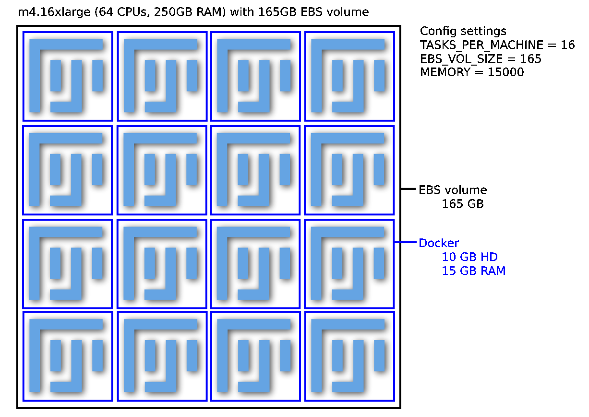
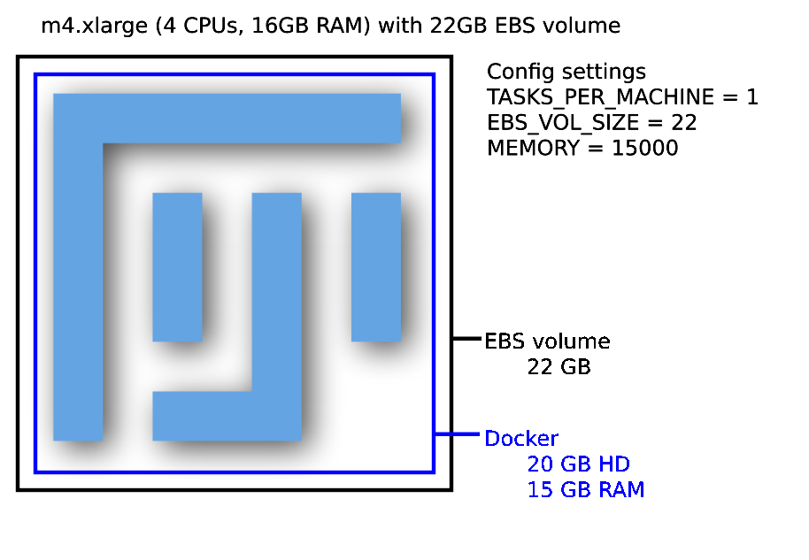

# Step 1: Configuration

The first step in setting up any job is editing the values in the config.py file.
Once the config file is created, simply type `python run.py setup` to set up your resources based on the configurations you've specified.

***

## Components of the config file

* **APP_NAME:** This will be used to tie your clusters, tasks, services, logs, and alarms together.
It need not be unique, but it should be descriptive enough that you can tell jobs apart if you're running multiple jobs.

***
### DOCKER REGISTRY INFORMATION

* **DOCKERHUB_TAG:** This is the encapsulated version of FIJI you will be running.

***

### AWS GENERAL SETTINGS
These are settings that will allow your instances to be configured correctly and access the resources they need - see [Step 0: Prep](step_0_prep.md) for more information.

***

### EC2 AND ECS INFORMATION

* **ECS_CLUSTER:** Which ECS cluster you'd like the jobs to go into.
All AWS accounts come with a "default" cluster, but you may add more clusters if you like.
Distinct clusters for each job are not necessary, but if you're running multiple jobs at once it can help avoid the wrong Docker containers going to the wrong instances.
* **CLUSTER_MACHINES:** How many EC2 instances you want to have in your cluster.
* **TASKS_PER_MACHINE:** How many Docker containers to place on each machine.
* **MACHINE_TYPE:** A list of what type(s) of machines your spot fleet should contain.
* **MACHINE_PRICE:** How much you're willing to pay per hour for each machine launched.
AWS has a handy [price history tracker](https://console.aws.amazon.com/ec2sp/v1/spot/home) you can use to make a reasonable estimate of how much to bid.
If your jobs complete quickly and/or you don't need the data immediately you can reduce your bid accordingly; jobs that may take many hours to finish or that you need results from immediately may justify a higher bid.
* **EBS_VOL_SIZE:** The size of the temporary hard drive associated with each EC2 instance in GB.
The minimum allowed is 22.
If you have multiple Dockers running per machine, each Docker will have access to (EBS_VOL_SIZE/TASKS_PER_MACHINE) - 2 GB of space.
* **DOWNLOAD_FILES:** Whether or not to download the image files to the EBS volume before processing.
This completely bypasses mounting the source bucket with S3FS.
This typically requires a larger EBS volume (depending on the size of your image sets, and how many sets are processed per group).
It avoids occasional issues with S3FS that can crop up on longer runs and permissions issues with mounting a source bucket.

***

### DOCKER INSTANCE RUNNING ENVIRONMENT
* **MEMORY:** How much memory each Docker container may have.
* **SCRIPT_DOWNLOAD_URL:** Where to download the FIJI script you will be running.

***

### SQS QUEUE INFORMATION

* **SQS_QUEUE_NAME:** The name of the queue where all of your jobs will be sent.
* **SQS_MESSAGE_VISIBILITY:** How long each job is hidden from view before being allowed to be tried again.
We recommend setting this to slightly longer than the average amount of time it takes an individual job to process - if you set it too short, you may waste resources doing the same job multiple times; if you set it too long, your instances may have to wait around a long while to access a job that was sent to an instance that stalled or has since been terminated.
See [SQS_QUEUE_information](SQS_QUEUE_information) for more information.
* **SQS_DEAD_LETTER_QUEUE:** The name of the queue to send jobs to if they fail to process correctly multiple times.
This keeps a single bad job (such as one where a single file has been corrupted) from keeping your cluster active indefinitely.
See [Step 0: Prep](step_0_prep.med) for more information.

***

### LOG GROUP INFORMATION

* **LOG_GROUP_NAME:** The name to give the log group that will monitor the progress of your jobs and allow you to check performance or look for problems after the fact.

### REDUNDANCY CHECKS

* **EXPECTED_NUMBER_FILES:** How many files need to be in the output folder in order to mark a job as completed.
* **MIN_FILE_SIZE_BYTES:** What is the minimal number of bytes an object should be to "count"?
Useful when trying to detect jobs that may have exported smaller corrupted files vs larger, full-size files.
* **NECESSARY_STRING:** This allows you to optionally set a string that must be included in your file to count towards the total in EXPECTED_NUMBER_FILES.
This can be helpful if your pipeline puts out a mixture of file types and you want to count only how many images were produced, for example.

### EXAMPLE CONFIGURATIONS

This is an example of one possible configuration. It's a fairly large machine that is able to process 16 jobs at the same time.

The Config settings for this example are:
TASKS_PER_MACHINE = 16 (number of Dockers)
EBS_VOL_SIZE = 165
MEMORY = 15000 (MB for each Docker)

This is an example of another possible configuration. When we run Distributed Fiji we tend to prefer running a larger number of smaller machine. This is an example of a configuration we often use. We might use a spot fleet of 100 of these machines (CLUSTER_MACHINES = 100).

The Config settings for this example are:
TASKS_PER_MACHINE = 1 (number of Dockers)
EBS_VOL_SIZE = 22
MEMORY = 15000 (MB for each Docker)
